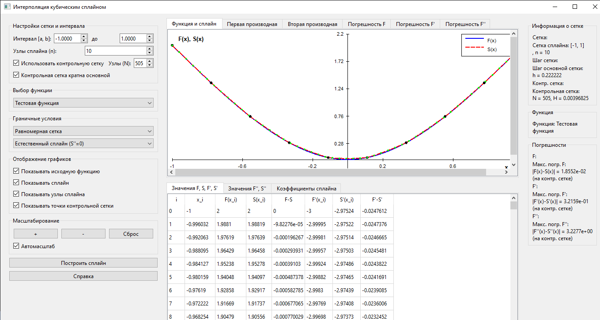

# Кубический сплайн

Приложение для интерполяции функций с использованием кубических сплайнов. Проект разработан как лабораторная работа по численным методам.

## Описание

Данное Qt-приложение позволяет строить кубические сплайны для различных функций с использованием различных типов граничных условий. Приложение предоставляет графическое представление функции, сплайна и погрешностей, а также таблицы со значениями и коэффициентами сплайна.

### Основные возможности

- Интерполяция с помощью кубического сплайна
- Поддержка различных граничных условий:
  - Естественный сплайн (S''(a) = S''(b) = 0)
  - Заданные первые производные (S'(a), S'(b))
  - Заданные вторые производные (S''(a), S''(b))
- Выбор из различных тестовых функций
- Настраиваемая контрольная сетка для более точного отображения графиков
- Расчет погрешностей для функции и её производных
- Отображение таблиц значений и коэффициентов сплайна

## Требования

- Qt 6 или выше
- C++17 совместимый компилятор
- CMake 3.5 или выше

## Сборка и установка

### Ubuntu

```bash
# Установка зависимостей
sudo apt update
sudo apt install -y build-essential cmake qt6-base-dev qt6-tools-dev qt6-tools-dev-tools libqt6charts6-dev

# Клонирование репозитория
git clone https://github.com/yourusername/nm_lab_spline.git
cd nm_lab_spline

# Создание директории для сборки
mkdir build && cd build

# Конфигурация и сборка
cmake ..
make

# Запуск приложения
./spl
```

### Windows (с использованием Qt Creator)

1. Установите [Qt 6](https://www.qt.io/download-qt-installer) и убедитесь, что установлены компоненты `Qt 6.5+`, `CMake`, и `MinGW` (или другой совместимый компилятор).
2. Клонируйте репозиторий с помощью Git Bash:
   ```bash
   git clone https://github.com/yourusername/nm_lab_spline.git
   ```
3. Откройте проект в Qt Creator (файл `CMakeLists.txt`).
4. Настройте комплект сборки (Kit), выбрав Qt 6 и соответствующий компилятор.
5. Нажмите "Сборка" (Ctrl+B).
6. Запустите приложение (Ctrl+R).

### Windows (с использованием MSYS2)

1. Установите [MSYS2](https://www.msys2.org/).
2. Откройте MSYS2 и обновите пакеты:
   ```bash
   pacman -Syu
   pacman -Syu # Повторите команду после перезапуска MSYS2, если потребуется
   ```
3. Установите необходимые пакеты:
   ```bash
   pacman -S --needed base-devel mingw-w64-x86_64-toolchain mingw-w64-x86_64-qt6 mingw-w64-x86_64-cmake
   ```
4. Клонируйте репозиторий:
   ```bash
   git clone https://github.com/yourusername/nm_lab_spline.git
   cd nm_lab_spline
   ```
5. Создайте директорию для сборки и выполните сборку:
   ```bash
   mkdir build && cd build
   cmake -G "MinGW Makefiles" ..
   mingw32-make
   ```
6. Запустите приложение:
   ```bash
   ./spl.exe
   ```

## Превью



## Использование

1. Выберите функцию из выпадающего списка
2. Задайте интервал [a, b] для построения сплайна
3. Укажите количество узлов сплайна (n)
4. Выберите тип граничных условий
5. При необходимости настройте параметры контрольной сетки
6. Нажмите кнопку "Построить сплайн"
7. Исследуйте функцию, сплайн и погрешности на графиках и в таблицах

## Структура проекта

- `main.cpp` - точка входа в программу
- `mainwindow.cpp/h` - основной класс пользовательского интерфейса
- `headers/` - заголовочные файлы
  - `Solver.h` - класс решателя для построения сплайна
  - `Spline.h` - класс, представляющий кубический сплайн
  - `Problems.h` - класс с набором тестовых функций
  - `Functions.h` - вспомогательные функции
  - `tridiagonal_matrix_algorithm.h` - алгоритм прогонки для решения СЛАУ
- `src/` - исходные файлы

## Лицензия

[MIT](https://opensource.org/licenses/MIT)
